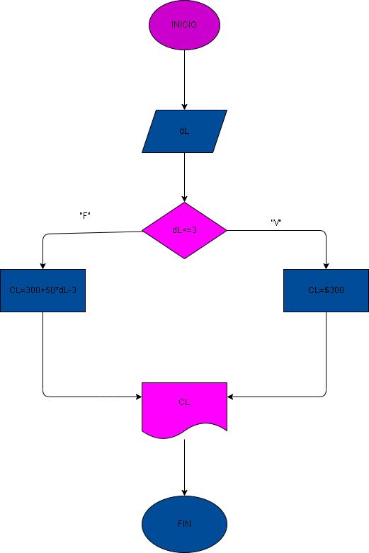

# llamada_telefonica
ingresar el tiempo de duración de una llamada telefónica y determinar la cantidad a pagar de acuerdo con lo siguiente: -a: toda llamada que dure 3 minutos tiene un costo de 300 pesos  -b: cada minuto adicional cuesta 50 pesos

# Analisis

# Diseño

### Diagrama de flujo

